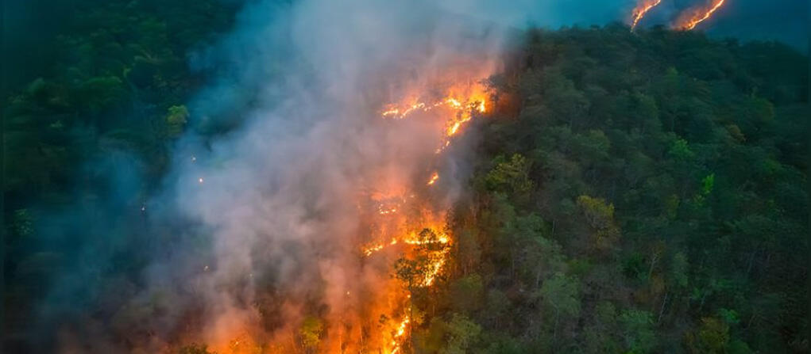

# California Wildfire Simulation
## MSDS 460 Term Project
### Hamdi Kucukengin and Maddy Lok | 13 March 2025

---

# Wildfires in California
- **Objective**: Simulating wildfires in California in order to better understand fire spread and structural damages to optimize the allocation of emergency response and resources. 
- Simulated based on general wildfires in the greater Los Angeles area and specifically the Camp Fire of 2018. 
- **Methodology**: Utilized Python and *discrete-event simulation*. 

---

# Background
- Wildfires are a significant natural disaster that commonly occurs in California.
- The Camp Fire occurred in Northern California in 2018 and was the most destructive and catastrophic wildfire in California history. 
- **Technology**: Infrared satellite data, ground-based sensors, AI
- *Concerns*: 
    - Not a ton of easily accessible data
    - Wildfires spread inconsistently and there are a lot of external factors that contribute to the progression of a fire.

---

# Methodology
- Discrete event simulation: able to track sequences of events that occur at specific times
- Tracking structural damage and fire progression.
- **Tools**: Utilized multiple different Python tools such as SimPy, Folium, Geopandas, and Matplotlib
- **Data**: 
    - Real-world fire spread data of the Camp Fire from the National Institute of Standards and Technology
    - NASA Infrared VIIRS
    - CAL Fire Damage Inspection (DINS)

---

# Results

- **Metrics Tracked:**
    - Structural damage and fire spread rate of Camp Fire
    - Locations of largest wildfires in the greater Los Angeles area
- **Visualizations**: 
    - Heatmap of fire intensities in LA
    - Timelapse animation of fire spread in Los Angeles in 2018
    - Fire progression and structural damage of Camp Fire
    - Animated map of Camp Fire progression

